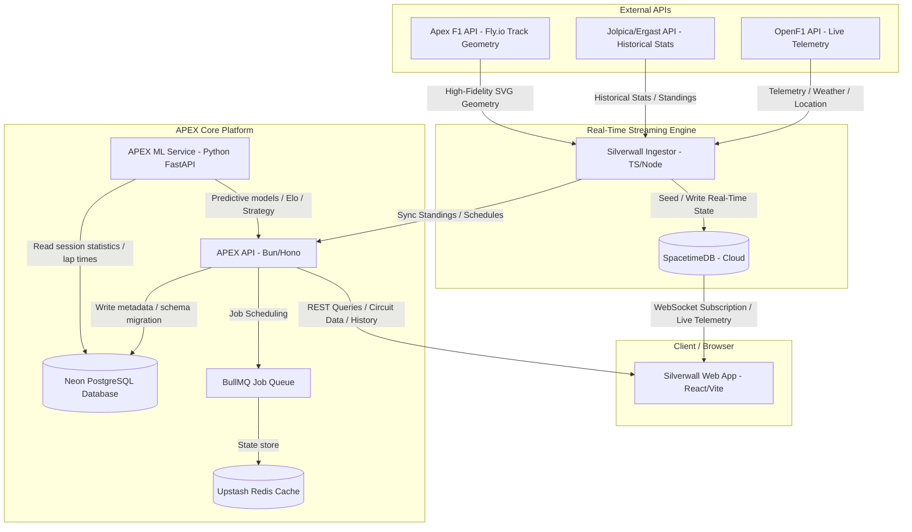

# APEX — F1 Analytical Platform & Prediction Engine

APEX is the analytical and historical brain that sits alongside Silverwall (the live F1 pitwall application). While Silverwall handles live telemetry and active race-weekend state, APEX drives historical statistics, strategy simulations, 3D track renderers, and machine learning outcomes.

<p align="center">
  
  
  
  
  
  
  
  <br />
  
  
  
  
  
  
  
  
</p>

---

## Final System Architecture

The diagram below details the integration between **Silverwall** (Real-Time Pitwall) and **APEX** (Analytical Platform & ML Engine), demonstrating how data flows from external APIs through our ingestion pipeline into our cloud databases and out to the client browser:



---

## Monorepo Architecture

The project is structured as a **Turborepo** monorepo:

```
apex/
├── apps/
│   ├── api/          → Bun + Hono (Main REST API & Ingest Pipeline)
│   ├── ml/           → Python FastAPI (Machine Learning microservice)
│   ├── web/          → React + Vite (Dashboard app)
│   └── embed/        → Vanilla Three.js (Embeddable 3D track widget)
├── packages/
│   ├── db/           → Drizzle schema & PostgreSQL migrations
│   ├── types/        → Shared TypeScript type definitions
│   └── track-utils/  → Geometry processing & elevation loading
```

---

## Tech Stack Overview

*   **Monorepo Tooling:** Turborepo
*   **Main REST API:** Bun + Hono
*   **Database ORM:** Drizzle
*   **Database:** Neon Serverless PostgreSQL (ap-south-1 Mumbai region)
*   **Cache & Queue:** Upstash Redis + BullMQ
*   **ML Microservice:** Python 3.12 + FastAPI + scikit-learn + XGBoost + pandas + statsmodels
*   **3D Geometry Renderer:** Three.js (vanilla ES module embed)
*   **Dashboard Web App:** React + Vite + Tailwind CSS + Recharts + D3 + Zustand
*   **E2E Testing:** Playwright (Desktop Chromium & Mobile Pixel 5 Chrome simulation)
*   **Hosting:** Fly.io (bom Mumbai region) for API/ML, Vercel for Dashboard, Upstash / Neon for databases.

---

## Phase 1 Foundation

### 1. Database Schema
Defined in `packages/db/src/schema.ts` and managed via Drizzle Kit:
*   `circuits`: Details on all F1 tracks.
*   `seasons`: Years and totals of race rounds.
*   `races`: Compounded primary key (`season` + `round`) with a unique serial index `id`.
*   `drivers` & `constructors`: Bio and team entries.
*   `results`: Driver placements, points, and final status.
*   `lap_times`: Lap performance metrics and sector breakdowns.
*   `qualifying` & `pit_stops`: Quali timings and pit lane stops.

### 2. Ingestion Pipeline
Standalone ingestion pipeline located in `apps/api/src/pipeline/ingest.ts` (triggered with `bun run ingest` inside `apps/api`):
*   Pulls historical datasets from the **Jolpica Ergast API**.
*   Leverages **BullMQ** for job processing and rate-limit queuing.
*   Uses a **1.5-second request throttling delay** to comply with Jolpica API rate limits.
*   Includes database caching checks to prevent redundant API hits and avoid rate-limiting.

### 3. REST API Core Endpoints
Exposes structured endpoints validated via Hono and documented interactively via **Scalar OpenAPI**:
*   `GET /api/circuits` — Fetch all circuits.
*   `GET /api/circuits/:id/geometry` — Get preprocessed 2D track points + elevation array.
*   `GET /api/seasons` — Fetch all historical seasons.
*   `GET /api/races/:season` — Fetch all races in a particular year.
*   `GET /api/drivers` — Paginated driver lists.
*   `GET /api/constructors` — Fetch all constructors.

---

## Local Development & Setup

### Prerequisites
*   [Bun](https://bun.sh/) (v1.x+)
*   [Docker Desktop](https://www.docker.com/products/docker-desktop/) (Started and running)

### 1. Environment Configuration
Copy the environment variables template and configure the values:
```bash
cp apex/.env.example apex/.env
```

### 2. Start Services (Local Postgres + Redis)
Start the Docker Compose containers:
```bash
docker compose -f apex/docker-compose.yml up -d
```

### 3. Database Migrations
Database schema migrations run **automatically on container startup** via the Hono app initializer.
To generate migrations manually after schema modifications:
```bash
# Inside apex/packages/db
bun run db:generate
```

### 4. Running the API Dev Server
```bash
# Inside apex/apps/api
bun run dev
```
The Hono API will start on `http://localhost:3000`. You can access the interactive documentation at `http://localhost:3000/docs`.

### 5. Seed Historical Data
Run the data ingestion pipeline to seed the local database:
```bash
# Inside apex/apps/api
bun run ingest
```

### 6. Pipeline Utility Scripts
To help manage the ingestion queue and local database state during development, the following commands are available under `apps/api`:
*   `bun run reset-pipeline` — Safely drains/cleans the BullMQ queue and truncates the database tables in order of foreign key dependencies before queueing a fresh, clean `ingest-all` job.
*   `bun run check-queue` — Queries the Redis cache and prints the current BullMQ job counts (`active`, `delayed`, `failed`, `waiting`).

---

## Cloud Deployment (Fly.io)

### 1. Runtime Boot Crash Fix
To prevent Bun workspace boot issues on Fly.io, the API deployment utilizes a working-directory context-switching command structure:
```toml
# fly.toml
[build]
  dockerfile = "apps/api/Dockerfile"
```
```dockerfile
# apps/api/Dockerfile
CMD ["bun", "run", "--cwd", "apps/api", "start"]
```

### 2. PostgreSQL Compatibility
The database migration configuration is compatible with vanilla PostgreSQL (as hosted on Fly.io Postgres or Neon), removing requirements for the TimescaleDB hypertable extensions while retaining performance indexing for F1 lap/telemetry data.

---

## Implemented Telemetry & Machine Learning Models

APEX is equipped with fully active Python-based machine learning pipelines (`apps/ml`) connected directly to the React dashboard pages, comprising 9 core prediction models:

### 1. Driver ELO Ratings (`apps/ml/src/models/elo.py`)
*   **Core Logic:** Isolates driver skill from constructor performance by weighting same-car teammate qualifying and race comparisons.
*   **Features:** Implements continuous qualifying outcomes scaled via sigmoid lap time differences, rookie cold-starts, and mechanical DNF filtering.
*   **UI Dashboard:** Displays teammate Elo matchups, head-to-head dominance gauges, and a round-by-round Elo progression sparkline line chart.

### 2. Tyre degradation & Lap Time Predictor (`apps/ml/src/models/lap_time.py`)
*   **Core Logic:** Trains dynamic Ridge and XGBoost regression models on historical timings grouped by stints, excluding safety cars and pace outliers.
*   **Features:** Applies a linear fuel-burn rate correction (0.03s per kg of fuel) to reduce model pace variance.
*   **Live Stint Simulator:** Exposes a simulation endpoint generating noisy lap-by-lap stints with temperature offsets, fuel burn, and real-time tyre health updates showing the thermal cliff.
*   **UI Dashboard:** Includes static analytic charts with confidence bounds ($\pm 1\sigma$) overlaid with actual stint timing scatter points, plus a live interactive simulator control panel with real-time wear gauges.

### 3. Optimal Pit Stop Strategy (`apps/ml/src/models/strategy.py`)
*   **Core Logic:** Performs stint search evaluating pit stops to minimize overall race time.
*   **Features:** Integrates a Safety Car rate Poisson model per track, downweighting pit lane loss by $50\%$ if SC likelihood is high.
*   **UI Dashboard:** Features strategy cards comparing primary/alternative strategy timelines, recommended vs. actual box laps, and undercut/overcut delta impact calculations.

### 4. Monte Carlo Championship Simulator (`apps/ml/src/models/simulation.py`)
*   **Core Logic:** Dynamic 50,000-run NumPy-vectorized simulator utilizing active driver points, constructor teams, and average finish positions from the database.
*   **UI Dashboard:** Displays circular dial gauges for WDC/WCC probabilities, and compares simulated standings side-by-side with actual results for completed seasons (2022-2025).

### 5. Driver Form Index (`apps/ml/src/models/driver_form.py`)
*   **Core Logic:** Computes a dynamic 0–100 form index per driver using Exponentially Weighted Moving Average (EWMA) of recent pace, qualifying gaps, and expected finish offsets (decay λ = 0.08).
*   **Features:** Detects form trends (`IMPROVING`, `STABLE`, `DECLINING`), consistency scores (based on lap time variance), and teammate pace deltas.
*   **UI Dashboard:** Displays form index ratings and trend markers directly inline on the Driver Elo standings.

### 6. Weather Impact Model (`apps/ml/src/models/weather.py`)
*   **Core Logic:** Computes weather-induced lap time offsets based on track temperature, wind speed, and moisture levels, yielding compound recommendations and wet-weather skill ratios.
*   **UI Dashboard:** Integrates track/air temperature sliders, safety margin parameters, and grip wetness levels inside the Tyre and Pit Wall planners.

### 7. Race Outcome Predictor (`apps/ml/src/models/race_outcome.py`)
*   **Core Logic:** Uses an `XGBoost Classifier` to predict finishing position probability distributions (P1–P10) centered around expected finishes using starting grid slots, teammate Elo margins, driver form, and constructor affinities.
*   **Features:** Calculates Expected Points and Podium Probability.

### 8. DNF Risk & Reliability Predictor (`apps/ml/src/models/dnf_risk.py`)
*   **Core Logic:** Models reliability scales for constructors, driver crash multipliers, and street circuit coefficients using a Weibull survival distribution model to calculate lap-by-lap survival curves and failure breakdowns (Mechanical, Collision, Other).
*   **UI Dashboard:** Visualizes survival probability charts inside the Driver detail profile views.

### 9. Qualifying Position Predictor (`apps/ml/src/models/qualifying.py`)
*   **Core Logic:** Uses an `XGBoost Regressor` to predict qualifying placements, Q3 entries, and pole position probabilities, as well as track-temperature adjusted best lap times.
*   **UI Dashboard:** Populates qualifying forecast boards on the Race Preview tab.

### 10. Official F1 Ratings & Power Rankings Validation Dashboard (Planned)
*   **Core Logic:** Integrates comparative validation metrics demonstrating the mathematical calibration of APEX's teammate-weighted Elo ratings against official benchmarks (EA Sports F1 Game Overall Ratings and F1.com Power Rankings).
*   **Features:** Implements Pearson correlation ($r = 0.946$) and Mean Absolute Error ($MAE = 1.4\text{ pts}$) calculations across the 2022–2026 grids.

---

## Machine Learning Data Synchronization Pipeline

The monorepo features an automated data synchronization script in the API package. It queries database standings and stint lap times, pushes actual timings to the ML microservice cache, trains the regression models, and runs championship simulations.

To trigger the pipeline inside the API container:
```bash
docker exec apex-api bun run --cwd apps/api sync:ml
```

---

## CI/CD Pipeline

*   **Continuous Integration (`ci.yml`):** Automatically triggers lint checks (`eslint`), typecheck validation (`tsc`), and workspaces build testing on all pushes and pull requests to ensure monorepo integrity.
*   **E2E Browser Tests (`e2e.yml`):** Runs Playwright end-to-end tests validating layout responsiveness (desktop and mobile viewports), dynamic compound selectors, simulated vs actual metrics, API failure resilience (error boundaries and reconnection recovery), and live simulation tickers.
*   **Continuous Deployment:** On commits to `main`, automatically builds and deploys:
    *   **API Service (`deploy-api.yml`):** Deploys to Fly.io using the monorepo root context.
    *   **ML Service (`deploy-ml.yml`):** Deploys to Fly.io.
