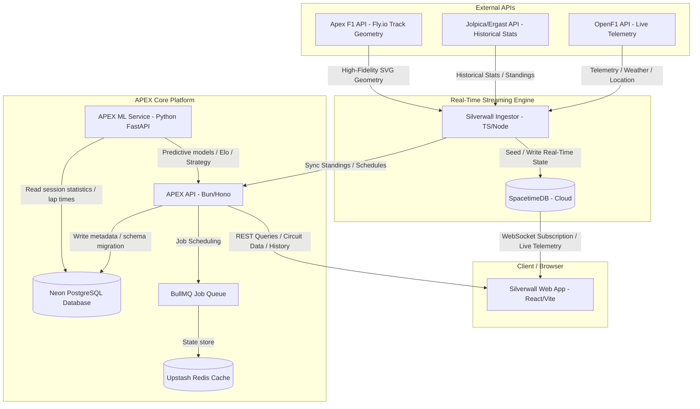

# APEX — F1 Analytical Platform & Prediction Engine

APEX is the analytical and historical brain that sits alongside Silverwall (the live F1 pitwall application). While Silverwall handles live telemetry and active race-weekend state, APEX drives historical statistics, strategy simulations, 3D track renderers, and machine learning outcomes.

<p align="center">
  
  
  
  
  
  
  
  <br />
  
  
  
  
  
  
  
  
</p>

---

## Final System Architecture

The diagram below details the integration between **Silverwall** (Real-Time Pitwall) and **APEX** (Analytical Platform & ML Engine), demonstrating how data flows from external APIs through our ingestion pipeline into our cloud databases and out to the client browser:



---

## Monorepo Architecture

The project is structured as a **Turborepo** monorepo:

```
apex/
├── apps/
│   ├── api/          → Bun + Hono (Main REST API & Ingest Pipeline)
│   ├── ml/           → Python FastAPI (Machine Learning microservice)
│   ├── web/          → React + Vite (Dashboard app)
│   └── embed/        → Vanilla Three.js (Embeddable 3D track widget)
├── packages/
│   ├── db/           → Drizzle schema & PostgreSQL migrations
│   ├── types/        → Shared TypeScript type definitions
│   └── track-utils/  → Geometry processing & elevation loading
```

---

## Tech Stack Overview

*   **Monorepo Tooling:** Turborepo
*   **Main REST API:** Bun + Hono
*   **Database ORM:** Drizzle
*   **Database:** Neon Serverless PostgreSQL (ap-south-1 Mumbai region)
*   **Cache & Queue:** Upstash Redis + BullMQ
*   **ML Microservice:** Python 3.12 + FastAPI + scikit-learn + XGBoost + pandas + statsmodels
*   **3D Geometry Renderer:** Three.js (vanilla ES module embed)
*   **Dashboard Web App:** React + Vite + Tailwind CSS + Recharts + D3 + Zustand
*   **Hosting:** Fly.io (bom Mumbai region) for API/ML, Vercel for Dashboard, Upstash / Neon for databases.

---

## Phase 1 Foundation

### 1. Database Schema
Defined in `packages/db/src/schema.ts` and managed via Drizzle Kit:
*   `circuits`: Details on all F1 tracks.
*   `seasons`: Years and totals of race rounds.
*   `races`: Compounded primary key (`season` + `round`) with a unique serial index `id`.
*   `drivers` & `constructors`: Bio and team entries.
*   `results`: Driver placements, points, and final status.
*   `lap_times`: Lap performance metrics and sector breakdowns.
*   `qualifying` & `pit_stops`: Quali timings and pit lane stops.

### 2. Ingestion Pipeline
Standalone ingestion pipeline located in `apps/api/src/pipeline/ingest.ts` (triggered with `bun run ingest` inside `apps/api`):
*   Pulls historical datasets from the **Jolpica Ergast API**.
*   Leverages **BullMQ** for job processing and rate-limit queuing.
*   Uses a **1.5-second request throttling delay** to comply with Jolpica API rate limits.
*   Includes database caching checks to prevent redundant API hits and avoid rate-limiting.

### 3. REST API Core Endpoints
Exposes structured endpoints validated via Hono and documented interactively via **Scalar OpenAPI**:
*   `GET /api/circuits` — Fetch all circuits.
*   `GET /api/circuits/:id/geometry` — Get preprocessed 2D track points + elevation array.
*   `GET /api/seasons` — Fetch all historical seasons.
*   `GET /api/races/:season` — Fetch all races in a particular year.
*   `GET /api/drivers` — Paginated driver lists.
*   `GET /api/constructors` — Fetch all constructors.

---

## Local Development & Setup

### Prerequisites
*   [Bun](https://bun.sh/) (v1.x+)
*   [Docker Desktop](https://www.docker.com/products/docker-desktop/) (Started and running)

### 1. Environment Configuration
Copy the environment variables template and configure the values:
```bash
cp apex/.env.example apex/.env
```

### 2. Start Services (Local Postgres + Redis)
Start the Docker Compose containers:
```bash
docker compose -f apex/docker-compose.yml up -d
```

### 3. Database Migrations
Database schema migrations run **automatically on container startup** via the Hono app initializer.
To generate migrations manually after schema modifications:
```bash
# Inside apex/packages/db
bun run db:generate
```

### 4. Running the API Dev Server
```bash
# Inside apex/apps/api
bun run dev
```
The Hono API will start on `http://localhost:3000`. You can access the interactive documentation at `http://localhost:3000/docs`.

### 5. Seed Historical Data
Run the data ingestion pipeline to seed the local database:
```bash
# Inside apex/apps/api
bun run ingest
```

### 6. Pipeline Utility Scripts
To help manage the ingestion queue and local database state during development, the following commands are available under `apps/api`:
*   `bun run reset-pipeline` — Safely drains/cleans the BullMQ queue and truncates the database tables in order of foreign key dependencies before queueing a fresh, clean `ingest-all` job.
*   `bun run check-queue` — Queries the Redis cache and prints the current BullMQ job counts (`active`, `delayed`, `failed`, `waiting`).

---

## Cloud Deployment (Fly.io)

### 1. Runtime Boot Crash Fix
To prevent Bun workspace boot issues on Fly.io, the API deployment utilizes a working-directory context-switching command structure:
```toml
# fly.toml
[build]
  dockerfile = "apps/api/Dockerfile"
```
```dockerfile
# apps/api/Dockerfile
CMD ["bun", "run", "--cwd", "apps/api", "start"]
```

### 2. PostgreSQL Compatibility
The database migration configuration is compatible with vanilla PostgreSQL (as hosted on Fly.io Postgres or Neon), removing requirements for the TimescaleDB hypertable extensions while retaining performance indexing for F1 lap/telemetry data.

---

## SpacetimeDB Real-time Bridge & ML Roadmap

APEX establishes a real-time predictive bridge using streamed session telemetry from Silverwall:
*   **Silverwall writes to:** `live_positions`, `live_gaps`, `session_state`, `live_timing`.
*   **APEX ML writes to:** `strategy_recommendation`, `championship_probability`, `predicted_laptime`.

### Python ML Microservice Roadmap
The FastAPI prediction microservice (`apps/ml`) executes data science computations:
1.  **Elo rating system:** Predict driver form based on teammate head-to-head race and qualifying metrics.
2.  **Lap time predictor:** Predict target lap times based on tyre compound, tyre life, and track temperature.
3.  **Optimal pit strategy:** Formulate recommendations for when to execute pit stops to minimize time lost in traffic.
